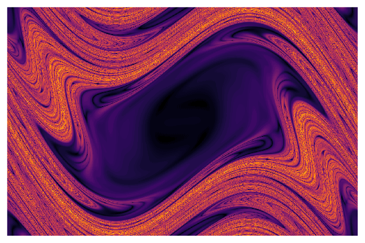
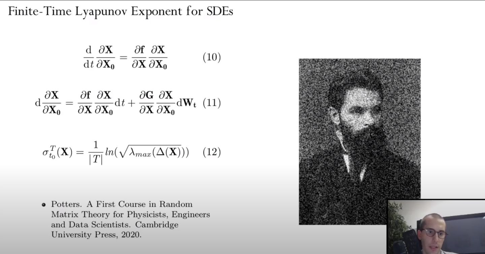

# FTLE.jl



Software developed for the work "Interplay between Chaos and Stochasticity in Celestial Mechanics" presented at [JuliaCon2022](https://juliacon.org/2022/):

[](https://www.youtube.com/watch?v=-VrRqANuvsk&t=382s)

## Abstract 

Chaotic behavior is omnipresent in celestial mechanics dynamical systems and it is relevant for both the understanding and leveraging the stability of planetary systems, the inner solar system in particular. The quantification of the probability of impacts of near-Earth objects after close encounters with celestial bodies; the possibility of designing robust low energy transfer trajectories, not limited to invariant manifolds but also leveraging the weak stability boundary for the design of the ballistic captures trajectories in time-dependent dynamical systems; the characterization of diffusion processes in Nearly-Integrable Hamiltonian systems in celestial mechanics. In order to have a robust description of chaos, therefore being able to describe chaotic motion in the context of dynamical systems characterized by parametric uncertainties, and in parallel being able to investigate the effect of random perturbations (e.g. Langevin equation, jump-diffusion processes) this work builds on “Polynomial Stochastic Dynamic Indicators” (Vasile, Manzi) in which tools from functional analysis, such as orthogonal polynomials (e.g. PolyChaos.jl) and more in general feature maps coming from the theory of support vector machine and kernel methods are used to approximate the functional describing a positive measure defining the state of the system.

## Contributors

Credits to [Stefano](https://github.com/cr0stata) and [Mattia](https://github.com/pet-m96) for their support in this work!


## Paper dependencies

The document can be built locally, the following dependencies need to be installed:
- Ruby
- latexmk

## Build process

Build the paper using:
```
$ latexmk -bibtex -pdf paper.tex
```

Clean up temporary files using:
```
$ latexmk -c
```

## Paper metadata

**IMPORTANT**
Some information for building the document (such as the title and keywords)
is provided through the `paper.yml` file and not through the usual `\title`
command. Respecting the process is important to avoid build errors when
submitting your work.

## Get from OverLeaf

The paper folder can be downloaded from [OverLeaf](https://www.overleaf.com/read/dcvvhkyynmzt).
